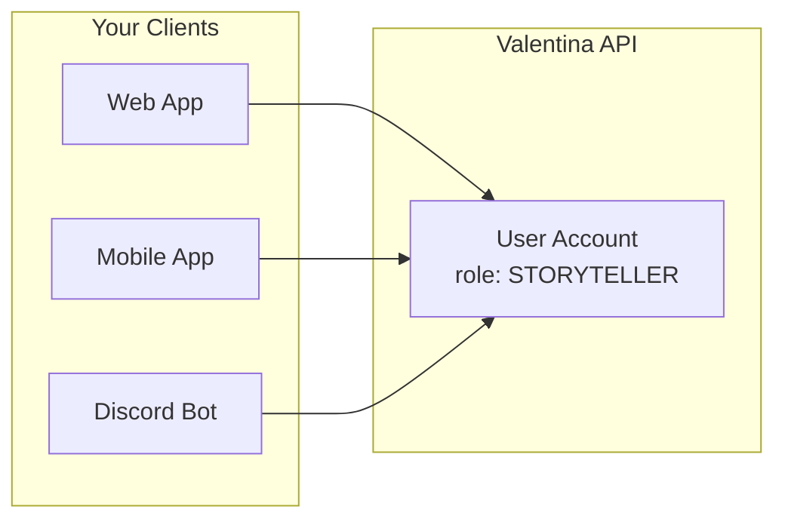

# User Management

## Overview

User authorization controls what actions end-users can perform within your application. Unlike [developer authentication](authentication.md) which secures API access, user authorization governs in-game permissions for players, storytellers, and administrators.

!!! warning "Your Responsibility"

    **Valentina Noir does not authenticate end-users directly.** Your application is responsible for authenticating users through your own system (OAuth, passwords, etc.) and then linking them to Valentina user accounts.

## Cross-Client Access

Users maintain the same identity and permissions regardless of which client they use to access Valentina:



This means:

-   A storyteller on your web app is also a storyteller on your mobile app
-   Character data, dice rolls, and campaign progress sync across all clients
-   Role changes apply immediately across all clients

### Linking Users

When a user authenticates with your application:

1. Check if you have a stored Valentina `user_id` for this user
2. If not, create a new user in Valentina via `POST /api/v1/companies/{company_id}/users`
3. Store the returned `user_id` in your user database
4. Use this `user_id` in subsequent API calls

```python
def get_or_create_valentina_user(local_user, company_id, api_key):
    """Link a local user to a Valentina user account."""

    # Check if we already have a Valentina user_id stored
    if local_user.valentina_user_id:
        return local_user.valentina_user_id

    # Create a new user in Valentina
    response = requests.post(
        f"https://api.valentina-noir.com/api/v1/companies/{company_id}/users",
        headers={"X-API-KEY": api_key},
        json={
            "name": local_user.display_name,
            "role": "PLAYER"
        }
    )
    response.raise_for_status()

    # Store the Valentina user_id
    valentina_user = response.json()
    local_user.valentina_user_id = valentina_user["id"]
    local_user.save()

    return valentina_user["id"]
```

## User Roles

Users are assigned to a [company](companies.md) and have a role that determines their permissions within that company. The same person may access your application from different clients (web, mobile, Discord bot) but will always be the same Valentina user with the same role.

| Role          | Description                                                       |
| ------------- | ----------------------------------------------------------------- |
| `PLAYER`      | Basic gameplay access - manage own characters                     |
| `STORYTELLER` | Campaign management - manage all characters and campaign settings |
| `ADMIN`       | Full user management within the company                           |

### Role Capabilities

**Player**

-   Create and manage their own characters
-   Roll dice and track experience
-   View campaign information
-   Cannot modify other players' characters

**Storyteller**

-   All player capabilities
-   Manage any character in their campaigns
-   Modify campaign settings (danger, desperation)
-   Create and manage NPCs
-   Award experience points

**Admin**

-   All storyteller capabilities
-   Manage other users within the company
-   Change user roles
-   Access administrative endpoints

## Checking User Roles

Retrieve a user's role when fetching their details:

```shell
GET /api/v1/companies/{company_id}/users/{user_id}
```

Response:

```json
{
    "id": "user123",
    "name": "John Doe",
    "role": "STORYTELLER",
    "company_id": "abc123"
}
```

## Authorization Errors

When a user attempts an action beyond their role's permissions, the API returns a `403 Forbidden` response:

```json
{
    "status": 403,
    "title": "Forbidden",
    "detail": "No rights to access this resource",
    "instance": "/api/v1/companies/abc123/users/user456/campaigns/camp789/characters/char012"
}
```

### Common Causes

| Scenario                           | Cause                                      |
| ---------------------------------- | ------------------------------------------ |
| Player editing another's character | User role is `PLAYER`, needs `STORYTELLER` |
| Player modifying campaign settings | User role is `PLAYER`, needs `STORYTELLER` |
| Storyteller managing other users   | User role is `STORYTELLER`, needs `ADMIN`  |

## Best Practices

1. **Authenticate users in your system first** - Use your own authentication before making Valentina API calls
2. **Store the user_id mapping** - Persist the relationship between your users and Valentina user accounts
3. **Cache user roles** - Avoid fetching user details on every request
4. **Handle 403 errors gracefully** - Provide clear feedback when users attempt unauthorized actions
5. **Respect role boundaries in your UI** - Hide or disable features users cannot access
6. **Consider role escalation carefully** - Changing a user's role affects all their access immediately
