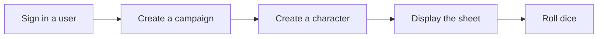

# Quickstart

Build a minimal Valentina Noir client from scratch. By the end of this guide your application will sign a player in, let them pick a campaign and a character, and roll that character's dice. That loop is the heart of every Valentina Noir client. Once it works, the rest of the API follows the same patterns.

This guide assumes you've skimmed [Core Concepts](../concepts/index.md) and are comfortable with REST APIs. Each step builds on the one before it, so work through them in order.

## What you'll build

The minimal client covers one complete gameplay loop: a signed-in player rolls dice for their character in a campaign.

Each step is its own page:

1. [Make your first request](setup.md) confirms your API key works and creates a company to develop against.
2. [Authenticate your users](users.md) links the people using your app to Valentina user accounts.
3. [Campaigns](campaigns.md) lists and creates the campaigns that hold a game.
4. [Create a character](characters.md) builds a character from the blueprint of classes, concepts, and traits.
5. [Display a character](character_sheet.md) renders that character's identity and sheet.
6. [Roll dice](dice_rolls.md) turns a character's traits into a dice pool and rolls.

## Prerequisites

You need two things before you start:

- A Valentina Noir developer account and an API key. Keys are available to approved developers only. [Request one](mailto:support@valentina-noir.com) if you don't have it yet.
- An HTTP client in the language of your choice. The examples use Python with [`requests`](https://requests.readthedocs.io/), but any client works. If you build in Python, the official [Valentina Noir Python Client](https://github.com/natelandau/valentina-python-client) wraps every endpoint with type hints.

!!! tip "Keep the full reference open"

    This guide shows the happy path for each step. For every parameter, field, and error code, keep the [full API documentation](https://api.valentina-noir.com/docs) open alongside it.

## How requests work

Every request carries your API key. Most game-resource requests also identify which end-user is acting. Two headers cover both cases.

| Header         | When to send it        | Purpose                                                          |
| -------------- | ---------------------- | ---------------------------------------------------------------- |
| `X-API-KEY`    | Every request          | Authenticates your application.                                  |
| `On-Behalf-Of` | Game-resource requests | Identifies the end-user acting, so the API can enforce their role. |

You'll start sending `X-API-KEY` in step 1 and add `On-Behalf-Of` in step 2. For the full rules, see [Authentication](../technical/authentication.md).

!!! tip "Where the enumerated values live"

    Whenever you need the valid values for a field (character classes, user roles, dice sizes, permission levels, and more), read them from the [enumerated values endpoint](../technical/enumerated_values.md) instead of hardcoding them. The steps below pull from it as needed.
