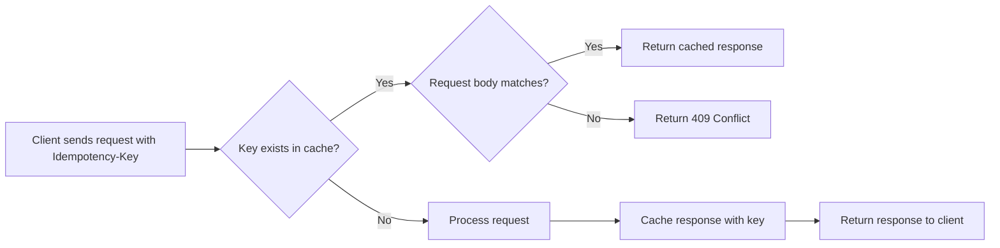

# Idempotency Keys

## Overview

Retry requests safely without duplicating operations using idempotency keys. This feature protects `POST`, `PUT`, and `PATCH` requests against duplicate operations caused by network issues, timeouts, or client retries.

## How It Works

The API processes idempotency keys in three steps:

1. Check if a response for that key exists in the cache
2. If cached, return the original response without re-executing the operation
3. If not cached, process the request and cache the response for 1 hour



## Usage

Add the `Idempotency-Key` header to any `POST`, `PUT`, or `PATCH` request:

```yaml
POST /api/v1/companies/{company_id}/users/{user_id}/campaigns HTTP/1.1
---
Host: api.valentina-noir.com
Content-Type: application/json
X-API-KEY: your-api-key
Idempotency-Key: 550e8400-e29b-41d4-a716-446655440000

{
    "name": "My Campaign"
    ...
}
```

## Key Format

| Requirement | Details                             |
| ----------- | ----------------------------------- |
| Type        | Unique string (UUID v4 recommended) |
| Max Length  | 255 characters                      |

## Supported Endpoints

All `POST`, `PUT`, and `PATCH` endpoints support idempotency. Include the `Idempotency-Key` header in your request to enable this feature.

!!! info "Naturally Idempotent Methods"

    `GET` and `DELETE` requests ignore the `Idempotency-Key` header because they are naturally idempotent.

## Body Validation

The API validates that request bodies match when reusing idempotency keys. Sending a request with the same key but different body returns a 409 Conflict error:

```json
{
    "status": 409,
    "title": "Conflict",
    "detail": "Idempotency key 'your-key' was previously used with a different request body. Each unique request must use a unique idempotency key.",
    "instance": "/api/v1/..."
}
```

!!! warning "Unique Keys Required"

    Each unique operation must use its own idempotency key. The API prevents accidental key reuse with different request bodies.

## Examples

### Python

```python
import uuid
import time
import requests

def create_campaign_with_retry(api_key, company_id, user_id, data, max_retries=3):
    """Create a campaign with automatic retry on server errors."""
    idempotency_key = str(uuid.uuid4())

    for attempt in range(max_retries):
        response = requests.post(
            f"https://api.valentina-noir.com/api/v1/companies/{company_id}/users/{user_id}/campaigns",
            headers={
                "X-API-KEY": api_key,
                "Idempotency-Key": idempotency_key,
                "Content-Type": "application/json"
            },
            json=data
        )

        if response.status_code < 500:
            return response

        # Server error - safe to retry with same idempotency key
        time.sleep(2 ** attempt)

    return response
```

### JavaScript

```javascript
async function createCampaign(apiKey, companyId, userId, data) {
    const idempotencyKey = crypto.randomUUID();

    const response = await fetch(
        `https://api.valentina-noir.com/api/v1/companies/${companyId}/users/${userId}/campaigns`,
        {
            method: "POST",
            headers: {
                "X-API-KEY": apiKey,
                "Idempotency-Key": idempotencyKey,
                "Content-Type": "application/json",
            },
            body: JSON.stringify(data),
        },
    );

    return response.json();
}
```

## Best Practices

1. **Generate unique keys** - Use UUIDs or combine a client-generated ID with a timestamp
2. **Store keys client-side** - Keep the idempotency key until you receive a successful response
3. **Reuse keys only for retries** - Use the same key only when retrying the exact same request
4. **Avoid key reuse** - Each unique operation needs its own key (enforced with 409 errors)
5. **Set retry limits** - Implement exponential backoff with a maximum retry count
