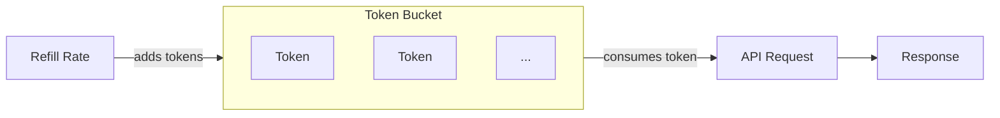

# Rate Limiting

## Overview

Valentina Noir uses a token bucket algorithm to enforce rate limits. This protects the API from abuse while allowing legitimate traffic bursts. Rate limit information is communicated through response headers following the [IETF draft specification](https://datatracker.ietf.org/doc/draft-ietf-httpapi-ratelimit-headers/).

## How Token Bucket Works

The token bucket algorithm provides a balance between steady-state rate limiting and burst capacity:

1. Each API key has a "bucket" that holds tokens
2. Tokens are added to the bucket at a constant rate (refill rate)
3. Each request consumes one token
4. If the bucket is empty, requests are rejected with `429 Too Many Requests`
5. The bucket has a maximum capacity (burst limit)



This means you can make rapid requests in bursts up to the bucket capacity, then must wait for tokens to refill.

## Response Headers

Every response includes rate limit headers:

```yaml
RateLimit-Policy: "default";q=50;w=60
RateLimit: "default";r=47;t=0
```

### RateLimit-Policy Header

Describes the rate limit policy applied to your request:

| Parameter | Description                                        |
| --------- | -------------------------------------------------- |
| `q`       | Bucket capacity (maximum tokens)                   |
| `w`       | Window in seconds (time to refill an empty bucket) |

### RateLimit Header

Describes your current rate limit status:

| Parameter | Description                                                |
| --------- | ---------------------------------------------------------- |
| `r`       | Remaining tokens in your bucket                            |
| `t`       | Seconds until next token is available (0 if tokens remain) |

## Understanding the Headers

Given these headers:

```yaml
RateLimit-Policy: "default";q=50;w=60
RateLimit: "default";r=10;t=0
```

This means:

-   **Policy**: 50 requests per 60 seconds (refill rate: ~0.83 tokens/second)
-   **Current state**: 10 tokens remaining, no wait required

## Handling Rate Limits

When rate limited, the API returns:

-   **Status**: `429 Too Many Requests`
-   **Headers**: Include `RateLimit` showing when to retry

```json
{
    "status": 429,
    "title": "Too Many Requests",
    "detail": "You are being rate limited.",
    "instance": "/api/v1/companies"
}
```

## Retry Strategy (Python)

Implement exponential backoff when rate limited:

```python
import time
import requests

def make_request_with_retry(url, api_key, max_retries=5):
    """Make a request with exponential backoff on rate limits."""
    headers = {"X-API-KEY": api_key}

    for attempt in range(max_retries):
        response = requests.get(url, headers=headers)

        if response.status_code == 429:
            # Parse the RateLimit header for retry timing
            rate_limit = response.headers.get("RateLimit", "")
            wait_time = 1  # Default wait

            # Extract 't' parameter (seconds until next token)
            if ";t=" in rate_limit:
                try:
                    t_value = rate_limit.split(";t=")[1].split(";")[0]
                    wait_time = max(1, int(t_value))
                except (IndexError, ValueError):
                    pass

            # Add exponential backoff
            wait_time = wait_time * (2 ** attempt)
            print(f"Rate limited. Waiting {wait_time} seconds...")
            time.sleep(wait_time)
            continue

        return response

    raise Exception("Max retries exceeded")
```

## Retry Strategy (JavaScript)

```javascript
async function makeRequestWithRetry(url, apiKey, maxRetries = 5) {
    const headers = { "X-API-KEY": apiKey };

    for (let attempt = 0; attempt < maxRetries; attempt++) {
        const response = await fetch(url, { headers });

        if (response.status === 429) {
            // Parse the RateLimit header for retry timing
            const rateLimit = response.headers.get("RateLimit") || "";
            let waitTime = 1; // Default wait

            // Extract 't' parameter (seconds until next token)
            const match = rateLimit.match(/;t=(\d+)/);
            if (match) {
                waitTime = Math.max(1, parseInt(match[1], 10));
            }

            // Add exponential backoff
            waitTime = waitTime * Math.pow(2, attempt);
            console.log(`Rate limited. Waiting ${waitTime} seconds...`);
            await new Promise((resolve) => setTimeout(resolve, waitTime * 1000));
            continue;
        }

        return response;
    }

    throw new Error("Max retries exceeded");
}
```

## Monitoring Your Usage

Track your rate limit consumption by parsing response headers:

```python
def check_rate_limit_status(response):
    """Parse and display rate limit status from response headers."""
    policy = response.headers.get("RateLimit-Policy", "")
    status = response.headers.get("RateLimit", "")

    print(f"Policy: {policy}")
    print(f"Status: {status}")

    # Extract remaining tokens
    if ";r=" in status:
        remaining = status.split(";r=")[1].split(";")[0]
        print(f"Remaining requests: {remaining}")
```

## Multiple Policies

Some endpoints may have multiple rate limit policies. When this occurs, headers contain comma-separated values:

```
RateLimit-Policy: "burst";q=10;w=1, "sustained";q=100;w=60
RateLimit: "burst";r=8;t=0, "sustained";r=95;t=0
```

This example shows both:

-   A burst limit: 10 requests per second
-   A sustained limit: 100 requests per minute

Your request is rejected if you exceed **any** applicable policy.

## Best Practices

1. **Monitor the `r` value** - Track remaining tokens to predict when you'll hit limits
2. **Implement backoff** - Use exponential backoff with jitter for retries
3. **Batch operations** - Combine multiple operations into single requests when possible
4. **Cache responses** - Use caching to reduce redundant API calls
5. **Spread requests** - Distribute requests evenly rather than bursting
6. **Handle 429 gracefully** - Never tight-loop on rate limit errors
