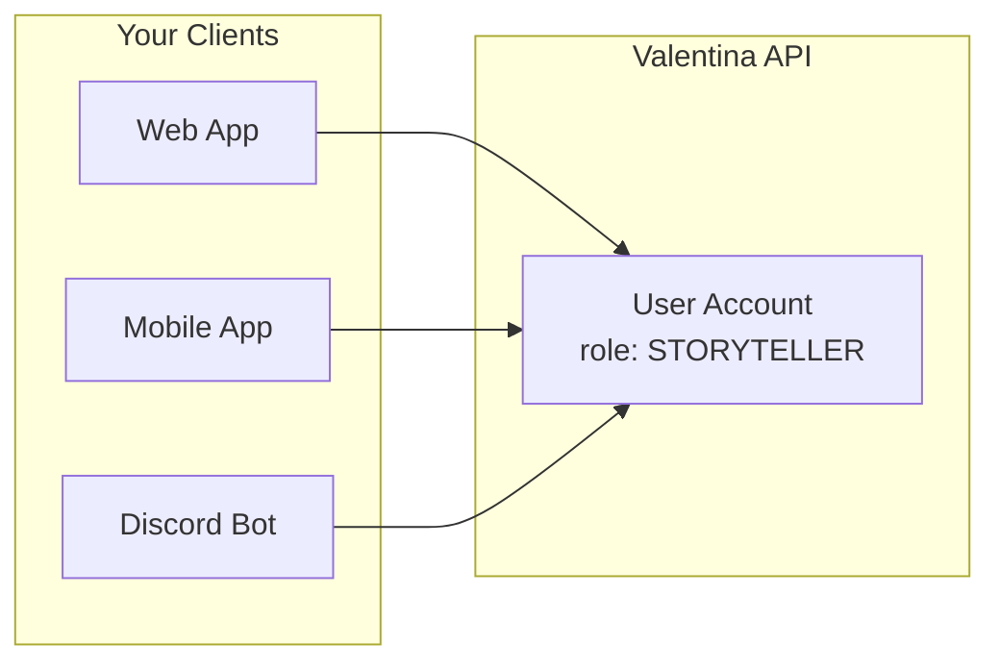

# User Management

## Overview

Control what actions end-users can perform within your application through user authorization. Unlike [developer authentication](authentication.md) which secures API access, user authorization governs in-game permissions for players, storytellers, and administrators.

!!! warning "Your Responsibility"
    **Valentina Noir does not authenticate end-users directly.** Your application authenticates users through your own system (OAuth, passwords, etc.), then links them to Valentina user accounts.

## Cross-Client Access

Users maintain the same identity and permissions across all clients that access Valentina.



**What this means:**

-   A storyteller on your web app has storyteller permissions on your mobile app
-   Character data, dice rolls, and campaign progress sync across all clients
-   Role changes take effect immediately across all clients

### Linking Users

Link your authenticated users to Valentina user accounts.

**Workflow:**

1. Check if you have a stored Valentina `user_id` for this user
2. If not, create a new user via `POST /api/v1/companies/{company_id}/users`
3. Store the returned `user_id` in your database
4. Use this `user_id` in subsequent API calls

```python
import requests

def get_or_create_valentina_user(local_user, company_id, api_key):
    """Link a local user to a Valentina user account."""
    # Return existing user_id if already linked
    if local_user.valentina_user_id:
        return local_user.valentina_user_id

    # Create a new user in Valentina
    response = requests.post(
        f"https://api.valentina-noir.com/api/v1/companies/{company_id}/users",
        headers={"X-API-KEY": api_key},
        json={
            "name": local_user.display_name,
            "email": local_user.email,
            "role": "PLAYER"
        }
    )
    response.raise_for_status()

    # Store and return the Valentina user_id
    valentina_user = response.json()
    local_user.valentina_user_id = valentina_user["id"]
    local_user.save()

    return valentina_user["id"]
```

## User Roles

Each user belongs to a [company](companies.md) and has a role that determines their permissions. Roles remain consistent across all clients (web, mobile, Discord bot).

| Role          | Description                                    |
| ------------- | ---------------------------------------------- |
| `PLAYER`      | Basic gameplay access - manage own characters  |
| `STORYTELLER` | Campaign management - manage all characters    |
| `ADMIN`       | Full user management and administrative access |

### Role Capabilities

Each role builds on the capabilities of the previous role.

??? info "Player Capabilities"
    -   Create and manage their own characters
    -   Roll dice and track experience
    -   View campaign information
    -   Cannot modify other players' characters

??? info "Storyteller Capabilities"
    -   All player capabilities
    -   Manage any character in their campaigns
    -   Modify campaign settings (danger, desperation)
    -   Create and manage NPCs
    -   Award experience points

??? info "Admin Capabilities"
    -   All storyteller capabilities
    -   Manage other users within the company
    -   Change user roles
    -   Access administrative endpoints

## Checking User Roles

Retrieve a user's role when fetching their details:

```shell
GET /api/v1/companies/{company_id}/users/{user_id}
```

Response:

```json
{
    "id": "user123",
    "name": "John Doe",
    "role": "STORYTELLER",
    "company_id": "abc123"
}
```

## Authorization Errors

The API returns a `403 Forbidden` response when a user attempts an action beyond their role's permissions.

```json
{
    "status": 403,
    "title": "Forbidden",
    "detail": "No rights to access this resource",
    "instance": "/api/v1/companies/abc123/users/user456/campaigns/camp789/characters/char012"
}
```

### Common Causes

| Scenario                           | Required Role |
| ---------------------------------- | ------------- |
| Player editing another's character | `STORYTELLER` |
| Player modifying campaign settings | `STORYTELLER` |
| Storyteller managing other users   | `ADMIN`       |

## Best Practices

!!! tip "Cache User Roles"
    Avoid fetching user details on every request by caching role information locally.

!!! warning "Role Changes Take Effect Immediately"
    Changing a user's role affects all their access across all clients instantly.

**Key recommendations:**

1. **Authenticate in your system first** - Use your own authentication before making Valentina API calls
2. **Store the user_id mapping** - Persist the relationship between your users and Valentina accounts
3. **Handle 403 errors gracefully** - Provide clear feedback when users attempt unauthorized actions
4. **Respect role boundaries in your UI** - Hide or disable features users cannot access
5. **Consider role escalation carefully** - Role changes affect access immediately across all clients
