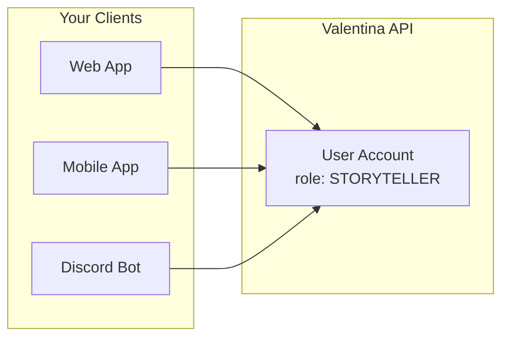
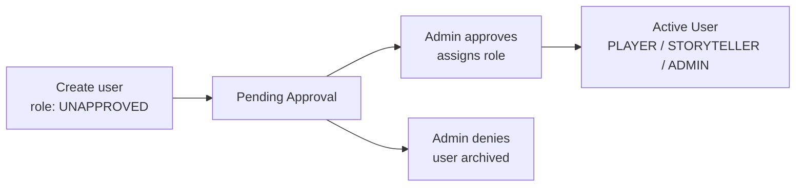

# User Management

## Overview

Control what actions end-users can perform within your application through user roles. [Developer permissions](authentication.md#developer-permissions) control company governance (managing the company, its settings, and developer access). User roles control **in-game actions** — what each end-user can do within a company.

The API enforces game rules based on user roles. For example, only storytellers can grant XP, and players can only edit their own characters. Your application assigns users to the correct roles, and the API enforces what each role can do.

!!! warning "Your Responsibility"

    **Valentina Noir doesn't authenticate end-users directly.** Your application authenticates users through your own system (OAuth, passwords, etc.), then makes API calls on their behalf using the `user_id` in the request path. The API trusts your application's assertion of which user is making the request.

## Cross-Client Access

Users maintain the same identity and permissions across all clients that access Valentina.


```mermaid
flowchart LR
    subgraph clients [Your Clients]
        Web[Web App]
        Mobile[Mobile App]
        Bot[Discord Bot]
    end

    subgraph valentina [Valentina API]
        User[User Account<br/>role: STORYTELLER]
    end

    Web --> User
    Mobile --> User
    Bot --> User
```

**What this means:**

- A storyteller on your web app has storyteller permissions on your mobile app
- Character data, dice rolls, and campaign progress sync across all clients
- Role changes take effect immediately across all clients

### Linking Users

Link your authenticated users to Valentina user accounts.

**Recommended Workflow with SSO:**

1. User authenticates via your identity provider (Google, GitHub, Discord, etc.)
2. Check if you have a stored Valentina `user_id` for this user
3. If not, search by email: `GET /api/v1/companies/{company_id}/users?email={email}`
4. If found, update the existing user's profile with the new OAuth info (via `PATCH`)
5. If not found, register a new user: `POST /api/v1/companies/{company_id}/users/register`
6. Store the returned `user_id` in your database

```python
import requests

API_URL = "https://api.valentina-noir.com/api/v1"
HEADERS = {"X-API-KEY": "your-api-key"}

def get_or_create_valentina_user(sso_user, company_id):
    """Link an SSO user to a Valentina user account."""
    # Return existing user_id if already linked
    if sso_user.valentina_user_id:
        return sso_user.valentina_user_id

    # Check if a user with this email already exists
    response = requests.get(
        f"{API_URL}/companies/{company_id}/users",
        headers=HEADERS,
        params={"email": sso_user.email},
    )
    existing_users = response.json()["items"]

    if existing_users:
        # Link to existing user and update their profile
        valentina_user_id = existing_users[0]["id"]
        requests.patch(
            f"{API_URL}/companies/{company_id}/users/{valentina_user_id}",
            headers=HEADERS,
            json={
                "google_profile": {"email": sso_user.email, "username": sso_user.name},
                "requesting_user_id": valentina_user_id,
            },
        )
    else:
        # Register a new UNAPPROVED user
        response = requests.post(
            f"{API_URL}/companies/{company_id}/users/register",
            headers=HEADERS,
            json={
                "username": sso_user.username,
                "email": sso_user.email,
                "google_profile": {
                    "email": sso_user.email,
                    "username": sso_user.name,
                },
            },
        )
        response.raise_for_status()
        valentina_user_id = response.json()["id"]

    # Store and return the Valentina user_id
    sso_user.valentina_user_id = valentina_user_id
    sso_user.save()
    return valentina_user_id
```

### Merging Users

When a duplicate UNAPPROVED user is created (e.g., a user authenticates via a new identity provider before you matched them to their existing account), merge the accounts:

```shell
POST /api/v1/companies/{company_id}/users/merge
```

```json
{
    "primary_user_id": "existing_user_id",
    "secondary_user_id": "unapproved_duplicate_id",
    "requesting_user_id": "admin_user_id"
}
```

The merge:

- Copies OAuth profile fields from the secondary user to the primary (only fills empty fields)
- Archives the secondary user and removes them from the company
- Returns the updated primary user

!!! warning "Secondary Must Be UNAPPROVED"

    The secondary user must have the `UNAPPROVED` role. This prevents accidental data loss from merging active users who may have characters, campaigns, and experience.

## User Roles

Each user belongs to a [company](companies.md) and has a role that determines their permissions. Roles remain consistent across all clients (web, mobile, Discord bot).

| Role          | Description                                    |
| ------------- | ---------------------------------------------- |
| `UNAPPROVED`  | Pending admin approval - no access to features |
| `PLAYER`      | Basic gameplay access - manage own characters  |
| `STORYTELLER` | Campaign management - manage all characters    |
| `ADMIN`       | Full user management and administrative access |
| `DEACTIVATED` | The user cannot log in or perform any action. Their characters, owned assets, XP records, and notes remain intact in the system and continue to be manageable by other users. Distinct from archival/soft-delete. |

### Role Assignment Hierarchy

Roles can only be assigned or modified by users with sufficient authority. The hierarchy is as follows:

- **ADMIN:** May assign any role (`ADMIN`, `STORYTELLER`, `PLAYER`, `DEACTIVATED`) to any user (except see Last-Admin Protection below)
- **STORYTELLER:** May assign `STORYTELLER` or `PLAYER` to non-admin targets only; cannot assign or modify `ADMIN` or `DEACTIVATED` roles
- **PLAYER / UNAPPROVED / DEACTIVATED:** Cannot change any role

A user may not change their own role unless the role-assignment hierarchy would otherwise allow it (e.g., an `ADMIN` may still self-demote if other `ADMIN` users exist).

### Last-Admin Protection

Any mutation that would leave a company with zero active `ADMIN` users returns HTTP 409 Conflict with the detail "Cannot remove the last admin from the company". This applies to:

- Changing an ADMIN user's role to `STORYTELLER`, `PLAYER`, or `DEACTIVATED`
- Deactivating the last ADMIN
- Deleting the last ADMIN

Only create or reactivate an ADMIN to bypass this protection.

### Deactivation and Reactivation

Deactivation is performed via `PATCH /api/v1/companies/{company_id}/users/{user_id}` with `role: "DEACTIVATED"`. Reactivation uses the same endpoint with any other valid role. Only `ADMIN` users may deactivate or reactivate other users. A user cannot deactivate themselves.

### The UNAPPROVED Role

New users can be created with the `UNAPPROVED` role. These users exist in the system but can't access any features until an admin approves them. This is useful when your application requires an approval step before granting access — for example, a gaming community that vets new members before they can join campaigns.

Unapproved users:

- Can't create or manage characters
- Can't join campaigns or roll dice
- Can't access experience points or quick rolls
- Remain in this state until an admin approves or denies them

See [User Approval Workflow](#user-approval-workflow) for how to manage unapproved users.

### Self-Role-Edit

A user may not change their own role via `PATCH` unless the role-assignment hierarchy would otherwise allow it. For example:

- An `ADMIN` user may change their own role if other `ADMIN` users exist (hierarchy allows self-demotion)
- A `STORYTELLER` cannot change their own role to `ADMIN` (hierarchy forbids STORYTELLER→ADMIN assignment)
- A `PLAYER` cannot change their own role (hierarchy forbids non-admin self-promotion)

### Role Capabilities

Each role builds on the capabilities of the previous role.

??? info "Player Capabilities"

    -   Create and manage their own characters
    -   Roll dice and track experience
    -   View campaign information
    -   Cannot modify other players' characters

??? info "Storyteller Capabilities"

    -   All player capabilities
    -   Manage any character in their campaigns
    -   Modify campaign settings (danger, desperation)
    -   Create and manage NPCs
    -   Award experience points

??? info "Admin Capabilities"

    -   All storyteller capabilities
    -   Manage other users within the company
    -   Change user roles
    -   Access administrative endpoints

## Checking User Roles

Retrieve a user's role when fetching their details:

```shell
GET /api/v1/companies/{company_id}/users/{user_id}
```

Response:

```json
{
    "id": "user123",
    "name_first": "John",
    "name_last": "Doe",
    "username": "johndoe123",
    "role": "STORYTELLER",
    "company_id": "abc123"
}
```

## Authorization Errors

The API returns a `403 Forbidden` response when a user attempts an action beyond their role's permissions.

```json
{
    "status": 403,
    "title": "Forbidden",
    "detail": "No rights to access this resource",
    "instance": "/api/v1/companies/abc123/users/user456/campaigns/camp789/characters/char012"
}
```

### Common Causes

| Scenario                           | Required Role |
| ---------------------------------- | ------------- |
| Unapproved user accessing features | `PLAYER`+     |
| Player editing another's character | `STORYTELLER` |
| Player modifying campaign settings | `STORYTELLER` |
| Storyteller managing other users   | `ADMIN`       |
| Approving or denying users         | `ADMIN`       |

## User Approval Workflow

When you create users with the `UNAPPROVED` role, admins can review and approve or deny them through dedicated endpoints. This gives you control over who joins your company.


```mermaid
flowchart LR
    Create["Create user<br/>role: UNAPPROVED"] --> Pending["Pending Approval"]
    Pending --> Approve["Admin approves<br/>assigns role"]
    Pending --> Deny["Admin denies<br/>user archived"]
    Approve --> Active["Active User<br/>PLAYER / STORYTELLER / ADMIN"]
```

### List Pending Users

Retrieve all users awaiting approval within a company. Only admins can access this endpoint.

```shell
GET /api/v1/companies/{company_id}/users/unapproved?requesting_user_id={admin_user_id}
```

The `requesting_user_id` query parameter identifies the admin making the request. The response uses standard [pagination](pagination.md):

```json
{
    "items": [
        {
            "id": "user456",
            "username": "newplayer",
            "email": "newplayer@example.com",
            "role": "UNAPPROVED",
            "company_id": "abc123"
        }
    ],
    "total": 1,
    "limit": 10,
    "offset": 0
}
```

### Approve a User

Approve a pending user and assign them a role. The role must be `PLAYER`, `STORYTELLER`, or `ADMIN` — you can't approve a user back to `UNAPPROVED`.

```shell
POST /api/v1/companies/{company_id}/users/{user_id}/approve
```

```json
{
    "role": "PLAYER",
    "requesting_user_id": "admin_user_id"
}
```

The response returns the updated user object with the new role.

### Deny a User

Deny a pending user to remove them from the company. The user is archived (soft-deleted) and no longer appears in user listings.

```shell
POST /api/v1/companies/{company_id}/users/{user_id}/deny
```

```json
{
    "requesting_user_id": "admin_user_id"
}
```

> **Note:** Denied users are archived, not permanently deleted. They won't appear in queries but their data is preserved.

### Example: Approval Flow

Here's a complete example of registering a user via SSO and then approving them:

```python
import requests

API_URL = "https://api.valentina-noir.com/api/v1"
HEADERS = {"X-API-KEY": "your-api-key"}

# Step 1: Register an unapproved user (no admin required)
response = requests.post(
    f"{API_URL}/companies/{company_id}/users/register",
    headers=HEADERS,
    json={
        "username": "newplayer",
        "email": "newplayer@example.com",
        "google_profile": {
            "email": "newplayer@gmail.com",
        },
    }
)
new_user = response.json()

# Step 2: List pending users (admin reviews)
response = requests.get(
    f"{API_URL}/companies/{company_id}/users/unapproved",
    headers=HEADERS,
    params={"requesting_user_id": admin_user_id},
)
pending_users = response.json()["items"]

# Step 3: Approve the user with a role
response = requests.post(
    f"{API_URL}/companies/{company_id}/users/{new_user['id']}/approve",
    headers=HEADERS,
    json={
        "role": "PLAYER",
        "requesting_user_id": admin_user_id,
    }
)
approved_user = response.json()
# approved_user["role"] is now "PLAYER"
```

## Best Practices

!!! tip "Cache User Roles"

    Avoid fetching user details on every request by caching role information locally.

!!! warning "Role Changes Take Effect Immediately"

    Changing a user's role affects all their access across all clients instantly.

**Key recommendations:**

1. **Authenticate in your system first** - Use your own authentication before making Valentina API calls
2. **Store the user_id mapping** - Persist the relationship between your users and Valentina accounts
3. **Handle 403 errors gracefully** - Provide clear feedback when users attempt unauthorized actions
4. **Respect role boundaries in your UI** - Hide or disable features users cannot access
5. **Consider role escalation carefully** - Role changes affect access immediately across all clients
6. **Use the approval workflow for open communities** - Create users as `UNAPPROVED` when you want admin vetting before granting access
