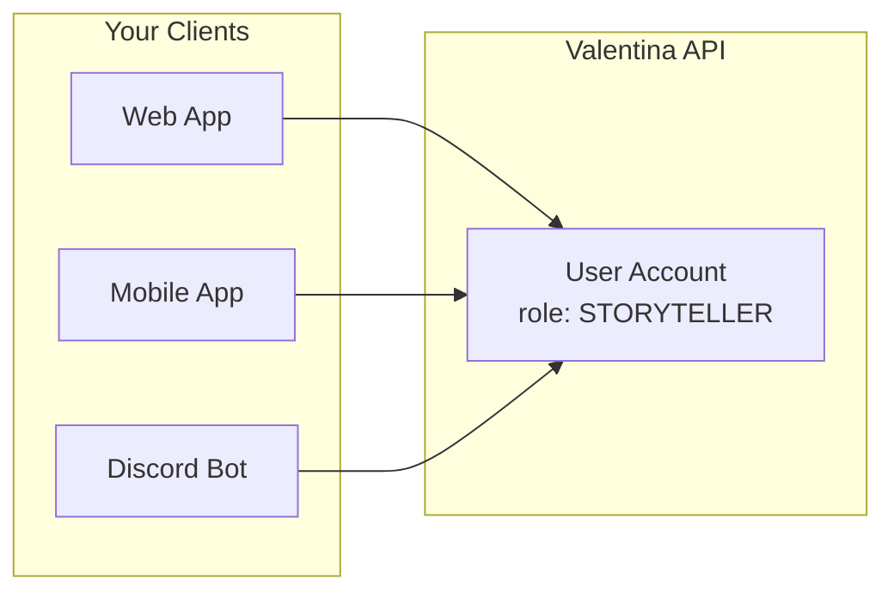
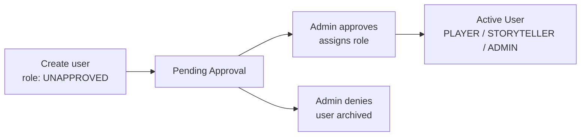

# User Management

## Overview

Control what actions end-users can perform within your application through user roles. [Developer permissions](authentication.md#developer-permissions) control company governance (managing the company, its settings, and developer access). User roles control **in-game actions** — what each end-user can do within a company.

The API enforces game rules based on user roles. For example, only storytellers can grant XP, and players can only edit their own characters. Your application assigns users to the correct roles, and the API enforces what each role can do.

The API supports two models for connecting your users to Valentina accounts:

- **Assertion** - your application authenticates users itself, then asserts their identity via the `On-Behalf-Of` header. Use this for bots and trusted server-side clients that manage their own sessions. See [On-Behalf-Of](authentication.md#the-on-behalf-of-header).
- **Verified identity** - your client forwards a provider credential (Apple/Google OIDC ID token, Discord/GitHub OAuth access token) to Valentina, which verifies it and resolves the user automatically. Use this for apps where users sign in with a provider directly. See [Verified Identity](authentication.md#verified-identity) and the [identify endpoint](#identify-resolve-a-provider-login) below.

!!! warning "Your Responsibility"

    **Valentina Noir doesn't authenticate end-users directly.** Your application authenticates users through your own system (OAuth, passwords, etc.), then makes API calls on their behalf using the [`On-Behalf-Of` header](authentication.md#the-on-behalf-of-header). The API trusts your application's assertion of which user is making the request.

## Cross-Client Access

Users maintain the same identity and permissions across all clients that access Valentina.


```mermaid
flowchart LR
    subgraph clients [Your Clients]
        Web[Web App]
        Mobile[Mobile App]
        Bot[Discord Bot]
    end

    subgraph valentina [Valentina API]
        User[User Account<br/>role: STORYTELLER]
    end

    Web --> User
    Mobile --> User
    Bot --> User
```

**What this means:**

- A storyteller on your web app has storyteller permissions on your mobile app
- Character data, dice rolls, and campaign progress sync across all clients
- Role changes take effect immediately across all clients

### Identify: resolve a provider login

`POST /companies/{company_id}/auth/identify` is the recommended way to handle logins when your users authenticate with a provider (Apple, Google, Discord, or GitHub). Your client obtains the provider credential during the sign-in flow, then forwards it to this endpoint. Valentina verifies it with the provider and resolves the user in order:

1. **Provider ID match** - finds the user whose stored provider profile has the same subject ID.
2. **Verified email auto-link** - if the provider's verified email matches exactly one non-archived user (including `DEACTIVATED`), that user is linked to the provider profile.
3. **Create** - a new `UNAPPROVED` user is created when no match is found.

The response always returns `200 OK`:

```json
{
    "resolution": "matched",
    "user": {
        "id": "550e8400-e29b-41d4-a716-446655440000",
        "username": "marcus_player",
        "email": "marcus@example.com",
        "role": "PLAYER",
        "company_id": "7c9e6679-7425-40de-944b-e07fc1f90ae7",
        "...": "..."
    }
}
```

The `user` object is the full user response; fields are abbreviated here.

The `resolution` field indicates which path was taken:

| Value     | Meaning                                                              |
| --------- | -------------------------------------------------------------------- |
| `matched` | User found by provider ID.                                           |
| `linked`  | User found by provider-verified email and linked to the provider.   |
| `created` | No existing user found; a new `UNAPPROVED` user was created.         |

Use `user.id` as the value of `On-Behalf-Of` from that point on.

When a new user is created, include `username` and (if the provider does not supply an email) `email` in the request body. If the provider supplies no email and you don't include one, the endpoint returns `422 EMAIL_REQUIRED`. For provider token types and audience configuration, see [Verified Identity](authentication.md#verified-identity).

Auto-link by email requires a provider-verified email and exactly one matching user. When there are zero or two or more matches, the endpoint falls through to create a new user. Merge the duplicate afterwards if needed.

!!! note "DEACTIVATED users are auto-linked deliberately"

    Email auto-link intentionally includes `DEACTIVATED` users. Skipping them would create a new `UNAPPROVED` account with the same email, which could bypass deactivation if an admin later approves it. The user is linked to keep the identity unified; role guards still prevent them from acting.

### Link: attach a second provider identity

`POST /companies/{company_id}/users/{user_id}/identities` is the account-linking endpoint for settings flows. A user who already has a Valentina account (authenticated via any path) can connect a second provider. Only the user themselves or a company `ADMIN` may call this endpoint. It requires both `X-API-KEY` and `On-Behalf-Of`.

```bash
curl -X POST "$API/companies/$COMPANY_ID/users/$USER_ID/identities" \
  -H "X-API-KEY: $API_KEY" \
  -H "On-Behalf-Of: $USER_ID" \
  -H "Content-Type: application/json" \
  -d '{"provider": "github", "token": "<github-access-token>"}'
```

The endpoint verifies the credential with the provider and attaches it to the user. Re-linking the same identity is idempotent and refreshes the stored profile. The response is the updated user object.

**409 Conflict** with code `IDENTITY_ALREADY_LINKED` is returned in two cases:

- The identity belongs to a different user. Use the [merge endpoint](#merging-users) to combine accounts.
- The user already has a different identity from the same provider linked (e.g., trying to link a second Google account when one is already saved).

### Unlink: remove a provider identity

`DELETE /companies/{company_id}/users/{user_id}/identities/{provider}` is the counterpart to the link endpoint, for "disconnect account" settings flows. The `{provider}` path segment is one of `apple`, `google`, `discord`, or `github`. Only the user themselves or a company `ADMIN` may call it, and it requires both `X-API-KEY` and `On-Behalf-Of`. There is no request body.

```bash
curl -X DELETE "$API/companies/$COMPANY_ID/users/$USER_ID/identities/github" \
  -H "X-API-KEY: $API_KEY" \
  -H "On-Behalf-Of: $USER_ID"
```

The endpoint clears the matching `*_profile` column and returns the updated user object.

- **404 Not Found** with code `IDENTITY_NOT_LINKED` if the user has no identity from that provider.
- **409 Conflict** with code `LAST_IDENTITY` if it is the user's only linked identity. A user's final identity is protected so unlinking can never leave an account with no way to authenticate. Link another provider first, then retry.

### Provisioning users without a supported provider

For players who sign in through a provider Valentina verifies (Apple, Google, Discord, GitHub), use [`identify`](#identify-resolve-a-provider-login). It performs the lookup, linking, and first-time creation in a single call, so your client doesn't search by email or write profile data itself.

For players who authenticate some other way (email and password, or a provider Valentina doesn't verify), an admin provisions the account directly:

```python
import requests

API_URL = "https://api.valentina-noir.com/api/v1"

# An admin acting user is required, supplied with On-Behalf-Of
admin_headers = {"X-API-KEY": "your-api-key", "On-Behalf-Of": admin_user_id}

response = requests.post(
    f"{API_URL}/companies/{company_id}/users",
    headers=admin_headers,
    json={
        "username": "newplayer",
        "email": "newplayer@example.com",
        "role": "PLAYER",
    },
)
response.raise_for_status()
valentina_user_id = response.json()["id"]
```

An admin-created user is assigned its role at creation and skips the approval queue. The role must not be `UNAPPROVED` or `DEACTIVATED`.

> **Note:** Provider-identity profiles (`apple_profile`, `google_profile`, `github_profile`, `discord_profile`) are read-only on user create and update. They are written only when a verified credential reaches [`identify`](#identify-resolve-a-provider-login) or the [link endpoint](#link-attach-a-second-provider-identity), so an unverified profile can never reach the columns used to match identities.

### Cross-Company User Lookup

When your application manages multiple companies, use the lookup endpoint to discover whether a person already has accounts across your companies. This is designed for login and registration flows.

```shell
GET /api/v1/users/lookup?email=player@example.com
```

Search by **exactly one** identifier:

| Parameter    | Description                    |
|-------------|--------------------------------|
| `email`      | Exact match on user email     |
| `discord_id` | Discord profile ID            |
| `google_id`  | Google profile ID             |
| `github_id`  | GitHub profile ID             |
| `apple_id`   | Apple profile ID              |

Response:

```json
[
  {
    "company_id": "550e8400-e29b-41d4-a716-446655440000",
    "company_name": "Friday Night Games",
    "user_id": "6ba7b810-9dad-11d1-80b4-00c04fd430c8",
    "role": "PLAYER"
  },
  {
    "company_id": "7c9e6679-7425-40de-944b-e07fc1f90ae7",
    "company_name": "Downtown LARP",
    "user_id": "a3bb189e-8bf9-3888-9912-ace4e6543002",
    "role": "STORYTELLER"
  }
]
```

Results are scoped to companies where your API key has access. Archived users are excluded. Unapproved and deactivated users are included so your client can display appropriate status messaging.

Providing zero or multiple query parameters returns `400 Bad Request`.

### Merging Users

Merge is the cleanup path for situations where automatic resolution could not match accounts. This happens when:

- A duplicate `UNAPPROVED` user is created because no automatic match was possible.
- A user signed in with Apple's "Hide My Email" relay (`...@privaterelay.appleid.com`). Private-relay addresses are unique to each app and never match a user's real email on other providers, so `identify` always creates a new user for them rather than linking. After the user is recognized, merge the new account into the existing one or use the [link endpoint](#link-attach-a-second-provider-identity) to connect their Apple identity explicitly.

To merge accounts:

```yaml
POST /api/v1/companies/{company_id}/users/merge HTTP/1.1
---
Host: api.valentina-noir.com
X-API-KEY: your-api-key
On-Behalf-Of: admin_user_id
```

```json
{
    "primary_user_id": "existing_user_id",
    "secondary_user_id": "unapproved_duplicate_id"
}
```

The merge:

- Copies OAuth profile fields from the secondary user to the primary (only fills empty fields)
- Archives the secondary user and removes them from the company
- Returns the updated primary user

!!! warning "Secondary Must Be UNAPPROVED"

    The secondary user must have the `UNAPPROVED` role. This prevents accidental data loss from merging active users who may have characters, campaigns, and experience.

## User Roles

Each user belongs to a [company](companies.md) and has a role that determines their permissions. Roles remain consistent across all clients (web, mobile, Discord bot).

| Role          | Description                                    |
| ------------- | ---------------------------------------------- |
| `UNAPPROVED`  | Pending admin approval - no access to features |
| `PLAYER`      | Basic gameplay access - manage own characters  |
| `STORYTELLER` | Campaign management - manage all characters    |
| `ADMIN`       | Full user management and administrative access |
| `DEACTIVATED` | The user cannot log in or perform any action. Their characters, owned assets, XP records, and notes remain intact in the system and continue to be manageable by other users. Distinct from archival/soft-delete. |

### Role Assignment Hierarchy

Roles can only be assigned or modified by users with sufficient authority. The hierarchy is as follows:

- **ADMIN:** May assign any role (`ADMIN`, `STORYTELLER`, `PLAYER`, `DEACTIVATED`) to any user (except see Last-Admin Protection below)
- **STORYTELLER:** May assign `STORYTELLER` or `PLAYER` to non-admin targets only; cannot assign or modify `ADMIN` or `DEACTIVATED` roles
- **PLAYER / UNAPPROVED / DEACTIVATED:** Cannot change any role

A user may not change their own role unless the role-assignment hierarchy would otherwise allow it (e.g., an `ADMIN` may still self-demote if other `ADMIN` users exist).

### Last-Admin Protection

Any mutation that would leave a company with zero active `ADMIN` users returns HTTP 409 Conflict with the detail "Cannot remove the last admin from the company". This applies to:

- Changing an ADMIN user's role to `STORYTELLER`, `PLAYER`, or `DEACTIVATED`
- Deactivating the last ADMIN
- Deleting the last ADMIN

Only create or reactivate an ADMIN to bypass this protection.

### Deactivation and Reactivation

Deactivation is performed via `PATCH /api/v1/companies/{company_id}/users/{user_id}` with `role: "DEACTIVATED"`. Reactivation uses the same endpoint with any other valid role. Only `ADMIN` users may deactivate or reactivate other users. A user cannot deactivate themselves.

### The UNAPPROVED Role

New users can be created with the `UNAPPROVED` role. These users exist in the system but can't access any features until an admin approves them. This is useful when your application requires an approval step before granting access — for example, a gaming community that vets new members before they can join campaigns.

Unapproved users:

- Can't create or manage characters
- Can't join campaigns or roll dice
- Can't access experience points or quick rolls
- Remain in this state until an admin approves or denies them

See [User Approval Workflow](#user-approval-workflow) for how to manage unapproved users.

### Self-Role-Edit

A user may not change their own role via `PATCH` unless the role-assignment hierarchy would otherwise allow it. For example:

- An `ADMIN` user may change their own role if other `ADMIN` users exist (hierarchy allows self-demotion)
- A `STORYTELLER` cannot change their own role to `ADMIN` (hierarchy forbids STORYTELLER→ADMIN assignment)
- A `PLAYER` cannot change their own role (hierarchy forbids non-admin self-promotion)

### Role Capabilities

Each role builds on the capabilities of the previous role.

??? info "Player Capabilities"

    -   Create and manage their own characters
    -   Roll dice and track experience
    -   View campaign information
    -   Cannot modify other players' characters

??? info "Storyteller Capabilities"

    -   All player capabilities
    -   Manage any character in their campaigns
    -   Modify campaign settings (danger, desperation)
    -   Create and manage NPCs
    -   Award experience points

??? info "Admin Capabilities"

    -   All storyteller capabilities
    -   Manage other users within the company
    -   Change user roles
    -   Access administrative endpoints

## Checking User Roles

Retrieve a user's role when fetching their details:

```shell
GET /api/v1/companies/{company_id}/users/{user_id}
```

Response:

```json
{
    "id": "user123",
    "name_first": "John",
    "name_last": "Doe",
    "username": "johndoe123",
    "role": "STORYTELLER",
    "company_id": "abc123"
}
```

## Authorization Errors

The API returns a `403 Forbidden` response when a user attempts an action beyond their role's permissions.

```json
{
    "status": 403,
    "title": "Forbidden",
    "detail": "No rights to access this resource",
    "instance": "/api/v1/companies/abc123/users/user456/campaigns/camp789/characters/char012"
}
```

### Common Causes

| Scenario                           | Required Role |
| ---------------------------------- | ------------- |
| Unapproved user accessing features | `PLAYER`+     |
| Player editing another's character | `STORYTELLER` |
| Player modifying campaign settings | `STORYTELLER` |
| Storyteller managing other users   | `ADMIN`       |
| Approving or denying users         | `ADMIN`       |

## User Approval Workflow

When you create users with the `UNAPPROVED` role, admins can review and approve or deny them through dedicated endpoints. This gives you control over who joins your company.


```mermaid
flowchart LR
    Create["Create user<br/>role: UNAPPROVED"] --> Pending["Pending Approval"]
    Pending --> Approve["Admin approves<br/>assigns role"]
    Pending --> Deny["Admin denies<br/>user archived"]
    Approve --> Active["Active User<br/>PLAYER / STORYTELLER / ADMIN"]
```

### List Pending Users

Retrieve all users awaiting approval within a company. Only admins can access this endpoint.

```yaml
GET /api/v1/companies/{company_id}/users/unapproved HTTP/1.1
---
Host: api.valentina-noir.com
X-API-KEY: your-api-key
On-Behalf-Of: admin_user_id
```

The `On-Behalf-Of` header identifies the admin making the request. The response uses standard [pagination](pagination.md):

```json
{
    "items": [
        {
            "id": "user456",
            "username": "newplayer",
            "email": "newplayer@example.com",
            "role": "UNAPPROVED",
            "company_id": "abc123"
        }
    ],
    "total": 1,
    "limit": 10,
    "offset": 0
}
```

### Approve a User

Approve a pending user and assign them a role. The role must be `PLAYER`, `STORYTELLER`, or `ADMIN` — you can't approve a user back to `UNAPPROVED`.

```yaml
POST /api/v1/companies/{company_id}/users/{user_id}/approve HTTP/1.1
---
Host: api.valentina-noir.com
X-API-KEY: your-api-key
On-Behalf-Of: admin_user_id
```

```json
{
    "role": "PLAYER"
}
```

The response returns the updated user object with the new role.

### Deny a User

Deny a pending user to remove them from the company. The user is archived (soft-deleted) and no longer appears in user listings.

```yaml
POST /api/v1/companies/{company_id}/users/{user_id}/deny HTTP/1.1
---
Host: api.valentina-noir.com
X-API-KEY: your-api-key
On-Behalf-Of: admin_user_id
```

This endpoint doesn't take a request body.

> **Note:** Denied users are archived, not permanently deleted. They won't appear in queries but their data is preserved.

### Example: Approval Flow

Here's a complete example of onboarding a user via a provider login and then approving them:

```python
import requests

API_URL = "https://api.valentina-noir.com/api/v1"
HEADERS = {"X-API-KEY": "your-api-key"}

# Step 1: Resolve the provider credential to a user (no admin required).
# A first-time login creates an UNAPPROVED user.
response = requests.post(
    f"{API_URL}/companies/{company_id}/auth/identify",
    headers=HEADERS,
    json={
        "provider": "google",
        "token": google_id_token,
    },
)
new_user = response.json()["user"]

# Step 2: List pending users (admin reviews)
admin_headers = {**HEADERS, "On-Behalf-Of": admin_user_id}
response = requests.get(
    f"{API_URL}/companies/{company_id}/users/unapproved",
    headers=admin_headers,
)
pending_users = response.json()["items"]

# Step 3: Approve the user with a role
response = requests.post(
    f"{API_URL}/companies/{company_id}/users/{new_user['id']}/approve",
    headers=admin_headers,
    json={"role": "PLAYER"},
)
approved_user = response.json()
# approved_user["role"] is now "PLAYER"
```

## Best Practices

!!! tip "Cache User Roles"

    Avoid fetching user details on every request by caching role information locally.

!!! warning "Role Changes Take Effect Immediately"

    Changing a user's role affects all their access across all clients instantly.

**Key recommendations:**

1. **Authenticate in your system first** - Use your own authentication before making Valentina API calls
2. **Store the user_id mapping** - Persist the relationship between your users and Valentina accounts
3. **Handle 403 errors gracefully** - Provide clear feedback when users attempt unauthorized actions
4. **Respect role boundaries in your UI** - Hide or disable features users cannot access
5. **Consider role escalation carefully** - Role changes affect access immediately across all clients
6. **Use the approval workflow for open communities** - Create users as `UNAPPROVED` when you want admin vetting before granting access
